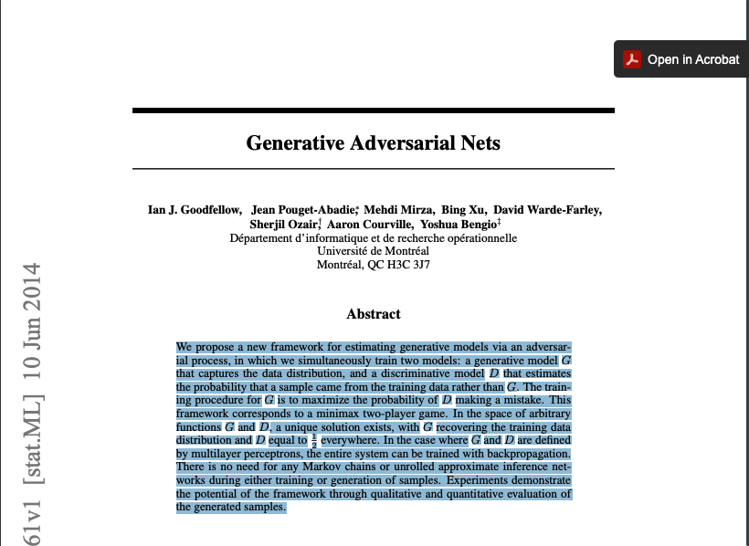
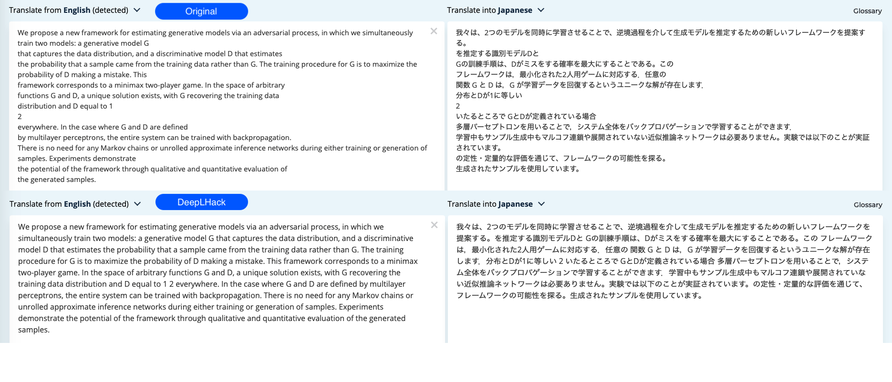

# Simple auto formatting tool for DeepL Translator: DeepLHack

This tool can fix this type of paste problem.
DeepLHack is the simplest auto-formatting tool to use DeepL Translator.

- Available in Several Platform(Windows, MacOS, Linux)
- No need to modify the clipboard to formatting. Just type Cmd(Ctrl)+Shift+V and reformat.
- You can mange git user env easily.

# Usage
The main function of this tools is just **remove redundant spaces from clipboard and paste to DeepL.**

## Example
When you want to translate sentences/paragraph from paper, Just copy and paste with Cmd+Shift+V(For windows, Ctrl+Shift+V) instead of Cmd+C, Cmd+C(Original default DeepL keybind).

Above translation was invoked with DeepL original keybind, Below translation was invoked with DeepLHack.

# Installation
## For Mac
download latest tools from [release pages](https://github.com/kouml/DeepLHack/releases)

## For Windows
download latest tools from [release pages](https://github.com/kouml/DeepLHack/releases)

## For Linux
download latest tools from [release pages](https://github.com/kouml/DeepLHack/releases)

# Usage

## Cmd(Ctrl)+Shift+V

